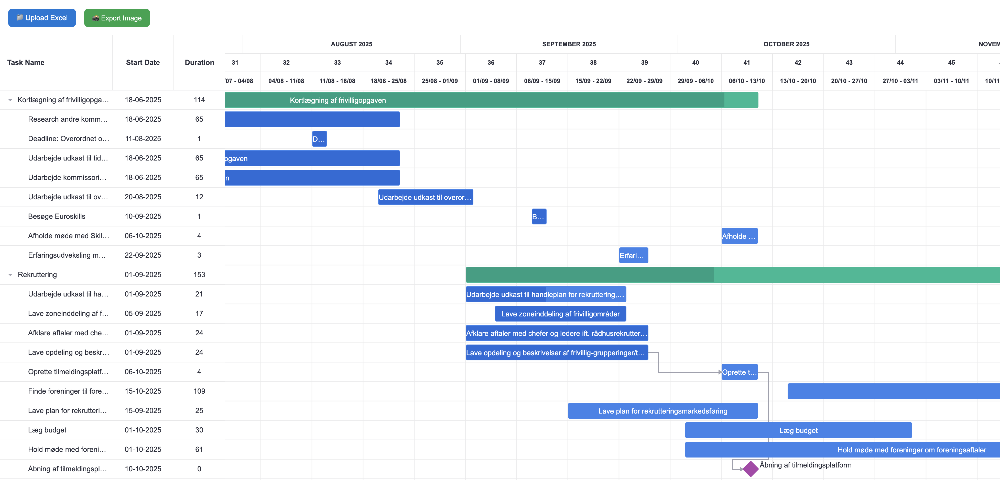

# MSplannerToGantt

A React-based tool for visualizing and exporting Microsoft Planner as Gantt charts.
From MS Planner you can export your project to Excel.
This tool parses the Excel task sheets and renders them interactively using [`wx-react-gantt`](https://www.npmjs.com/package/wx-react-gantt).


---

## 🧰 Prerequisites

* [VS Code](https://code.visualstudio.com/)
* [Docker Engine](https://docs.docker.com/engine/)

---

## 🧱 Development Setup (Dev Container)

1. Clone the repository

2. Open it in VS Code and **reopen in container** when prompted
   *(or manually: `Ctrl+Shift+P` → “Dev Containers: Reopen in Container”)*

3. Start the development server:

   ```bash
   npm run dev
   ```

   Your app should now be running at [http://localhost:5173](http://localhost:5173).

---

## 🚀 Deployment to GitHub Pages

Inside your dev container, run:

```bash
npm run build
npm run deploy
```

This builds and pushes the static site to the `gh-pages` branch.
After enabling GitHub Pages under your repo’s **Settings → Pages**,
your site will be live at:

```
https://williamwoldum.github.io/MSplannerToGantt
```